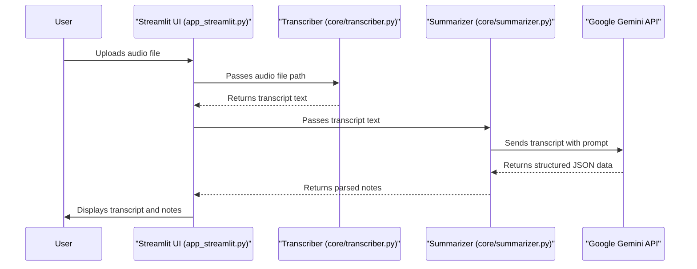

# Meeting Notes Extractor Architecture

The application is designed with a straightforward, pipeline-like architecture that processes an audio file in two main stages: transcription and summarization.

## 1. Streamlit User Interface (`app_streamlit.py`)

This is the front-end and orchestrator of the application. It's a web interface built with Streamlit that:

-   Allows the user to upload an audio file.
-   Triggers the processing pipeline.
-   Displays the raw transcript and the final structured notes (summary, action items, key decisions).

## 2. Audio Transcription (`core/transcriber.py`)

This module is responsible for converting the audio file into text. It uses the `openai-whisper` library to load a pre-trained Whisper model ("base" model) and perform the transcription locally.

## 3. Note Generation (`core/summarizer.py`)

This module takes the generated transcript and uses the Google Gemini API to extract meaningful information. It sends a carefully crafted prompt to the `gemini-flash-latest` model, asking for a JSON object containing:

-   `summary`: A brief overview of the meeting.
-   `action_items`: A list of tasks assigned during the meeting.
-   `key_decisions`: A list of decisions made.

## Architectural Diagram

The data flows through the application as follows:

