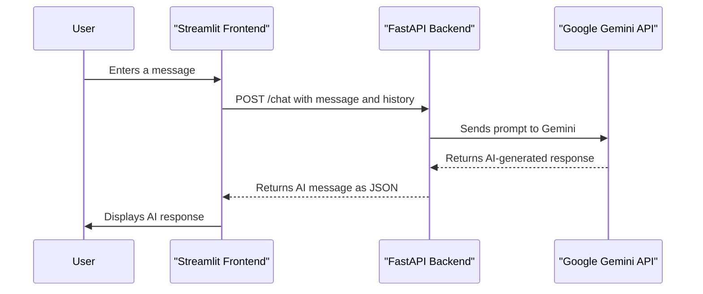

# Chatbot Architecture

The chatbot application follows a two-tier architecture, consisting of a frontend and a backend.

## 1. Frontend (Streamlit)

The frontend is a web application built using Streamlit (`streamlit_app2.py`). Its primary responsibilities are:

-   **User Interface (UI):** Provides a chat interface for users to interact with the AI assistant.
-   **User Input:** Captures the user's messages.
-   **State Management:** Manages the chat history in the Streamlit session state.
-   **API Communication:** Sends user messages to the backend API and displays the AI's responses.

## 2. Backend (FastAPI)

The backend is a RESTful API built using FastAPI (`fastapi_app2.py`). Its main responsibilities are:

-   **API Endpoints:** Exposes a `/chat` endpoint to handle chat requests.
-   **Business Logic:** Processes incoming messages, manages the conversation history, and interacts with the Gemini API.
-   **Gemini API Integration:** Communicates with the Google Gemini API to get responses from the AI model.
-   **CORS:** Handles Cross-Origin Resource Sharing (CORS) to allow the Streamlit frontend to communicate with the backend.

## Architectural Diagram

The following diagram illustrates the flow of information in the application:

