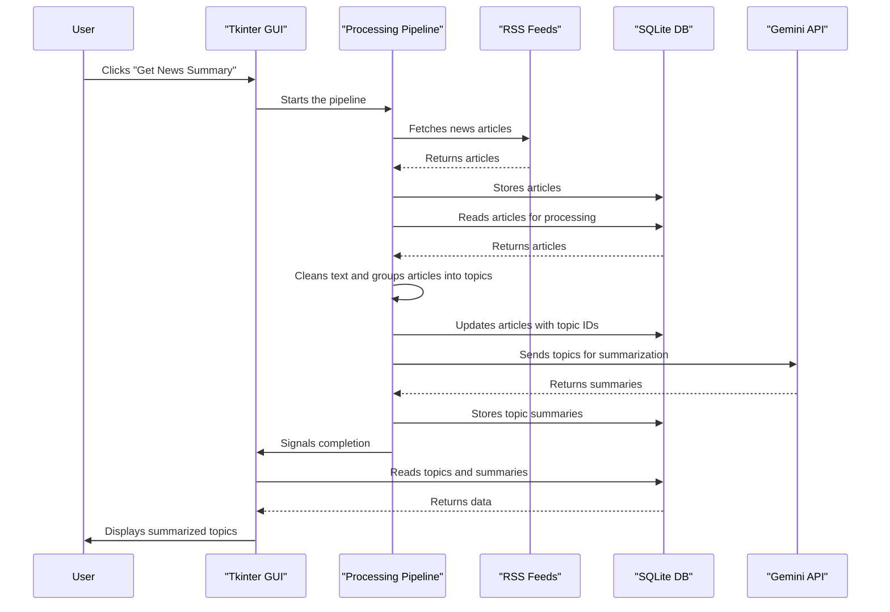

# Global News Tracker Architecture

The Global News Tracker is a multi-stage application that processes news data from ingestion to presentation. The architecture can be broken down into the following components:

## 1. Data Ingestion

-   **RSS Feeds:** The application uses the `feedparser` library to fetch news articles from a predefined list of Google News RSS feeds.

## 2. Database

-   **SQLite:** A local SQLite database (`global_news_topics.db`) is used to store the fetched articles and the generated topics. This allows for persistence of data between runs.

## 3. Data Processing

-   **Text Cleaning:** The text from the articles (title and summary) is cleaned to remove HTML tags, special characters, and extra whitespace.
-   **Topic Modeling:** The application uses `scikit-learn` to perform topic modeling:
    -   **TF-IDF Vectorization:** The cleaned text is converted into a matrix of TF-IDF features.
    -   **Cosine Similarity:** The cosine similarity between the TF-IDF vectors of the articles is calculated to determine their relatedness.
    -   **Clustering:** Articles with a similarity score above a certain threshold are grouped together into topics.

## 4. AI Summarization

-   **Google Gemini API:** For each identified topic, the application sends the text of the articles in that topic to the Google Gemini API. The API returns a concise summary of the topic, which is then stored in the database.

## 5. Graphical User Interface (GUI)

-   **Tkinter:** The application uses Python's built-in `tkinter` library to create a desktop GUI. The GUI displays the list of summarized topics, and allows the user to trigger the news processing pipeline.

## Architectural Diagram

The following diagram shows the flow of data through the application:

