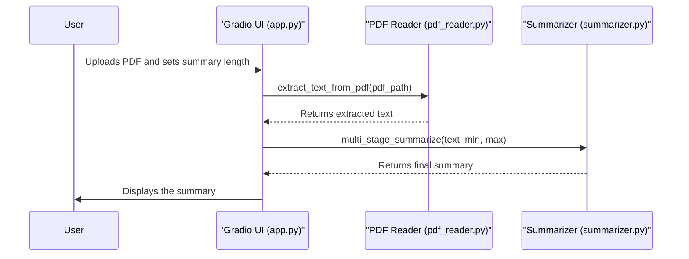

# PDF Summarizer Architecture

The PDF Summarizer application is built with a modular architecture, with each component responsible for a specific task.

## 1. Gradio User Interface (`app.py`)

The frontend of the application is a web interface created using Gradio. It provides the following functionalities:

-   A file uploader for users to submit their PDF documents.
-   Sliders to control the minimum and maximum length of the summary.
-   A textbox to display the final generated summary.
-   A progress bar to show the status of the summarization process.

## 2. PDF Reader (`pdf_reader.py`)

This module is responsible for extracting text from the PDF files. It uses the `PyMuPDF` library (`fitz`) to open the PDF and read the text from each page.

## 3. Summarizer (`summarizer.py`)

This is the core component of the application. It uses the Hugging Face `transformers` library to perform the summarization. The key features of this module are:

-   **Model Initialization:** It initializes a pre-trained summarization model (`facebook/bart-large-cnn` by default).
-   **Text Chunking:** For large documents, it splits the text into smaller chunks that can be processed by the model.
-   **Multi-Stage Summarization:** It summarizes each chunk individually and then combines the summaries to create a final, coherent summary of the entire document.

## Architectural Diagram

The following diagram illustrates the workflow of the application:

