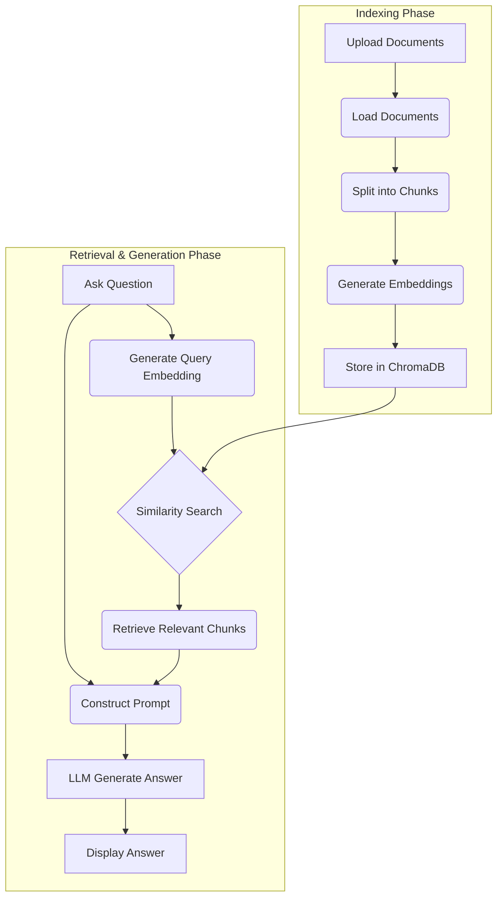

# RAGbot3 Architecture

The application is built on a classic Retrieval-Augmented Generation (RAG) architecture, orchestrated using the LangChain library. The process is divided into two main phases: an offline **Indexing Phase** and an online **Retrieval & Generation Phase**.

## 1. Indexing Phase (Document Processing)

This phase happens once you upload documents and click "Process Documents".

1.  **Load Documents:** The application uses LangChain's document loaders (`PyPDFLoader`, `TextLoader`, `Docx2txtLoader`) to read the content from the uploaded files.
2.  **Split Documents:** The loaded text is split into smaller, manageable chunks using `RecursiveCharacterTextSplitter`. This is crucial for fitting the context into the language model's context window.
3.  **Create Embeddings:** Each text chunk is converted into a numerical vector (an embedding) using the `sentence-transformers/all-MiniLM-L12-v2` model via `HuggingFaceEmbeddings`.
4.  **Store in Vector Database:** The text chunks and their corresponding embeddings are stored in a local `Chroma` vector database. This database is persisted on disk in the `./chroma_db` directory.

## 2. Retrieval & Generation Phase (Answering Questions)

This phase occurs every time you ask a question.

1.  **Embed Query:** The user's question is converted into an embedding using the same model from the indexing phase.
2.  **Retrieve Context:** The application performs a similarity search in the Chroma vector database to find the text chunks whose embeddings are most similar to the question embedding.
3.  **Construct Prompt:** A prompt is created using a template that includes the retrieved text chunks (the "context") and the original user question.
4.  **Generate Answer:** The complete prompt is passed to the local language model (`google/flan-t5-small`). The model generates an answer based *only* on the provided context.
5.  **Display Answer:** The generated answer is displayed to the user.

## Architectural Diagram

